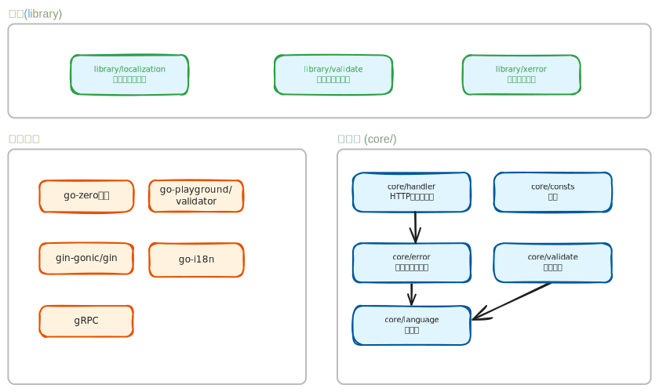

# API Hub

## 📦 项目说明

* 本项目基于go-zero微服务框架，旨在打造一个开箱即用的微服务开发脚手架。
* 通过框架与业务逻辑的解耦设计，让开发者能够专注于核心业务开发。只需简单配置，即可快速构建完整的微服务应用。

## 🏗️ 项目架构概览



### 外部依赖层

* **go-zero** - 微服务框架，提供API服务基础能力
* **gin-gonic/gin** - Web框架，用于HTTP服务
* **gRPC** - 远程过程调用框架
* **go-i18n** - 国际化支持库
* **go-playground/validator** - 数据验证库

### 核心包 (core/)

```plain
core/
├── handler/     # HTTP响应处理
├── error/       # 统一错误处理
├── language/    # 语言和国际化
├── consts/      # 常量定义
└── validate/    # 数据验证
```

### 库包 (library/)

```plain
library/
├── xerror/        # 定义错误码
├── localization/  # 翻译字典
└── validator/     # 自定义验证器
```

### 服务层

```plain
api/
└── gateway/    # API服务

rpc/
└── tools/      # RPC服务

test/           # 测试
tpl-1.8.4/      # 代码生成模板
deploy/         # 部署配置
doc/            # 项目文档
```

## 💡 设计特点

1. **分层架构** - 核心功能与业务逻辑分离
2. **统一错误处理** - 所有错误都通过核心错误处理器
3. **国际化支持** - 完整的多语言错误消息系统
4. **可扩展性** - 模块化设计便于功能扩展
5. **代码生成** - 基于模板的代码生成能力

## 🚀 使用方式

### 自定义参数校验

```go
// 实现自定义参数校验函数
// library/validator/example_validator.go
func ExampleValidator(v *validator.Validate, trans ut.Translator) error {
 if err := v.RegisterValidation("example_validator", chineseName); err != nil {
  return err
 }
 if err := v.RegisterTranslation("example_validator", trans, func(ut ut.Translator) error {
  ...
 }, func(ut ut.Translator, fe validator.FieldError) string {
  ...
 }
 return nil
}
```

```go
// 注册自定义参数校验函数
// api/gateway/svc/servicecontext.go
func NewServiceContext(c config.Config) *ServiceContext {
  ...
  validate.New([]validate.ValidatorFn{validator.ExampleValidator}, []string{"zh", "en"})
  ...
}
```

```go
// 在API定义中使用自定义参数校验函数
// api/gateway/gateway.api
type ExampleRequest {
  Name string `json:"name" comment:"FIELD_USERNAME" validate:"example_validator" `
}
```

### 自定义错误码

```go
// 定义错误码
// library/xerror/codes.go
var EmailFormatError = newerr(10047, "EMAIL_FORMAT_ERROR")
```

```toml
# 定义错误消息
# library/localization/error.zh.toml
EMAIL_FORMAT_ERROR =  "邮箱格式错误"

# library/localization/error.en.toml
EMAIL_FORMAT_ERRO = "Email format error"
```

## 🤔 QA

* 使用模板生成代码出现`<no value>`，如何解决？
  * 由于目前go-zero官方还未合并我的pr，暂时不支持projectPkg模板变量，可以选择使用我fork的goctl版本，或者等待官方合并。
  * 使用我fork的goctl版本：

      ```shell
      git clone https://github.com/geekeryy/go-zero.git
      cd go-zero/tools/goctl
      go install
      ```

## 登录类型

* 账号+密码
* 邮箱+密码
* 手机号+密码
* 邮箱+验证码
* 手机号+验证码
* 第三方登录：wechat、google、facebook


## 📝 TODO

* 框架：熔断、限流、降级、排队
* 框架：不用鉴权的api利用签名机制防止盗刷
* 框架：CICD
* 测试：单元测试、集成测试、性能测试、暴力测试
* 功能：可扩展的登录注册功能
* 功能：AI单轮聊天
